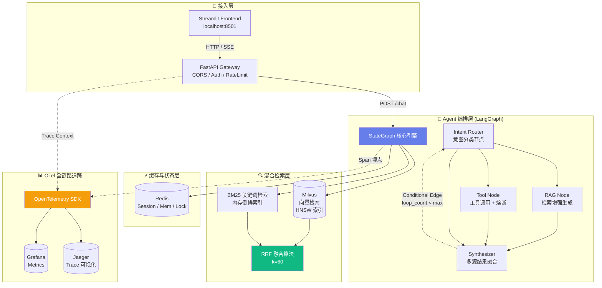

# 双体智能体系统 V2.0 架构设计与重构方案

> **文档性质**：技术架构设计文档 | **面向受众**：技术评审 / 架构委员会  
> **状态**：重构中 · 分支 `v2-dev` | **作者**：shuangti-agent 项目组

---

## 1. 重构背景与 V1.0 痛点分析

V1.0 基于 **LangChain AgentExecutor + ChromaDB + FastAPI** 的技术栈，在 MVP 阶段成功跑通了"RAG 知识库检索 → LLM 生成 → 工具调用"的完整业务闭环，并已在学院实际场景中投入使用。

然而，随着对话轮次复杂度上升和知识库规模增长，以下 3 个架构级痛点逐渐从"可容忍"演变为"必须解决"：

### 痛点一：Agent 黑盒导致死循环与 Token 失控

```text
┌─────────────────────────────────────────────────────────┐
│              LangChain AgentExecutor (黑盒)               │
│  ┌─────────────────────────────────────────────────────┐│
│  │  LLM Thought → Action → Observation → Thought → ...  ││
│  │        ↑_____________________________↓               ││
│  │        无状态追踪 · 无显式终止条件                      ││
│  └─────────────────────────────────────────────────────┘│
│  唯一止损手段: max_iterations = 10                        │
│  问题: 第 10 轮可能是第 2 轮就应该终止的无效循环              │
└─────────────────────────────────────────────────────────┘
```

| 具体表现 | 根因分析 |
|---------|---------|
| LLM 在多步联网搜索中反复调用同一 Tool，每次返回相似结果但无法识别"已获取足够信息" | `AgentExecutor` 将 Thought-Action-Observation 循环作为隐式上下文，缺乏显式的 `TaskProgress` 状态字段 |
| 复杂查询（如"对比三个方案并给出建议"）的 Token 消耗经常超过 8K，其中 60% 消耗在无效重试上 | 无回合级 Token 预算控制，LLM 自身也不具备"调用多少次算足够"的自我认知 |
| 错误 Tool 返回后 LLM 倾向于"换一种问法再试"而非向上汇报失败 | 缺乏工具调用审计机制，失败/重试模式不可被外部检测 |

### 痛点二：单一向量检索导致召回率衰减

V1.0 的 RAG 管道采用纯 Embedding 向量检索（ChromaDB），在以下场景下召回率显著下降：

- **精确匹配查询**（如"2023 级培养方案第 8 条"）：向量模型将其映射为泛化语义，Top-5 无关结果
- **低频专有名词**（如学院内部缩写"STP"、"菁英计划"）：Embedding 训练语料中未覆盖，向量表示退化为噪声
- **跨文档事实推理**（如"A 政策的截止日期在 B 文件中"）：向量检索只能返回独立 chunk，无法建立跨文档关联

### 痛点三：缺乏全链路可观测性

V1.0 的调试手段局限于 `logger.info()` 打点和 FastAPI 的 access log。一次对话请求的内部时延分布、LLM 调用次数、向量检索命中率等关键指标完全不可见。

> **核心判断**：这三个痛点不是"加个 if 判断"能解决的。Agent 的执行流需要从隐式变为显式，检索需要从单一变为混合，观测需要从日志变为 Trace——这决定了 V2.0 必须是一次架构级重构，而非 V1.0 上的增量修补。

---

## 2. V2.0 整体架构图



**架构分层逻辑**：

| 层级 | 职责 | V1.0 → V2.0 变化 |
|------|------|------------------|
| 接入层 | 认证、限流、SSE 流式响应 | 不变，FastAPI 已成熟 |
| 编排层 | Agent 执行流的显式状态管理 | **LangChain AgentExecutor → LangGraph StateGraph** |
| 检索层 | 双路召回 + RRF 融合排序 | **仅有向量检索 → 向量+BM25 混合检索** |
| 缓存/状态层 | 会话持久化、分布式锁、记忆图 | **仅内存级 → Redis 外部存储** |
| 监控旁路 | 全链路 Trace/Metrics/Logs | **完全新增** |

---

## 3. 核心模块一：基于 LangGraph 的 ReAct Agent 与熔断机制

### 3.1 为什么必须从 AgentExecutor 迁移到 LangGraph

| 维度 | LangChain AgentExecutor (V1.0) | LangGraph StateGraph (V2.0) |
|------|-------------------------------|----------------------------|
| **控制流** | 隐式，由 LLM Thought 驱动 | **显式**，由开发者定义的 DAG 边驱动 |
| **状态** | 仅 messages 列表，无结构化状态 | **TypedDict 状态机**，任意字段可读写 |
| **终止条件** | 单一 `max_iterations` | **多层守卫**：轮次上限 + 超时兜底 + 重复检测 + 自定义条件 |
| **可观测** | 无，执行过程完全黑盒 | **每个节点作为独立 Span**，Otel 自动埋点 |
| **回退策略** | 不支持 | **条件边**，失败可路由到 fallback 节点 |

简单来说：**AgentExecutor 试图让 LLM 通过 reasoning 自己决定"下一步做什么"，而 LangGraph 让开发者通过显式状态图定义"什么条件下做什么"——这让 Agent 从"黑盒推断"变成了"白盒编排"。**

### 3.2 三态熔断器设计

针对 V1.0 的死循环问题，V2.0 设计了三层熔断机制：

```text
                 ┌──────────────┐
                 │   L1: 轮次   │  硬上限 max_steps = 8
                 │   计数器     │  超过 → 强制路由到 Synthesizer
                 └──────┬───────┘
                        │ 未超限
                 ┌──────▼───────┐
                 │  L2: 连续调用 │  同一 Tool 连续 ≥ 3 次
                 │  重复检测器   │  触发 → 注入强制终止提示词
                 └──────┬───────┘
                        │ 未重复
                 ┌──────▼───────┐
                 │ L3: Token 预算│  单次对话总 Token > 8000
                 │   监控器      │  触发 → 截断+总结后退出
                 └──────────────┘
```

### 3.3 核心实现伪代码

```python
"""
V2.0 Agent 核心：基于 LangGraph StateGraph 的 ReAct Agent
包含三态熔断器与超时兜底机制
"""

from __future__ import annotations

import time
from dataclasses import dataclass, field
from enum import Enum
from typing import Annotated, Any, Literal

from langgraph.graph import StateGraph, END
from langgraph.graph.message import add_messages
from langgraph.checkpoint.redis import RedisSaver  # Redis 持久化状态


# ─── 状态定义 ───────────────────────────────────────────

class CircuitState(Enum):
    """三态熔断器状态"""
    CLOSED      = "closed"       # 正常通行
    HALF_OPEN   = "half_open"    # 试探性放行（连续重复检测中）
    OPEN        = "open"         # 熔断：强制跳过 Tool 调用


@dataclass
class AgentState:
    """
    LangGraph 共享状态 —— 每个节点可读写

    与 V1.0 的关键区别：
    - messages 不仅是对话历史，更是"执行轨迹"
    - 引入 step_counter / tool_call_history / token_budget 三个治理字段
    """
    messages: Annotated[list, add_messages] = field(default_factory=list)
    intent: str = ""                          # 意图路由结果
    step_counter: int = 0                     # L1: 当前轮次计数
    max_steps: int = 8                        # L1: 硬上限
    last_tool_name: str | None = None         # L2: 上一次调用的工具名
    consecutive_same_tool: int = 0            # L2: 连续相同工具调用次数
    max_consecutive: int = 3                  # L2: 连续重复阈值
    token_budget: int = 8000                  # L3: 总 Token 上限
    token_used: int = 0                       # L3: 已消耗 Token
    circuit: CircuitState = CircuitState.CLOSED
    should_exit: bool = False                  # 是否强制退出
    start_time: float = 0.0                   # 请求开始时间 (用于超时兜底)
    timeout_seconds: float = 30.0             # 整体超时阈值


# ─── 节点函数 ───────────────────────────────────────────

def node_intent_router(state: AgentState) -> dict[str, Any]:
    """
    意图路由节点：解析用户输入，决定进入 RAG / Tool / DirectChat 分支
    """
    last_msg = state["messages"][-1]
    # 实际实现会用轻量级 LLM 做意图分类，此处简化
    if "搜索" in last_msg.content or "查" in last_msg.content:
        state["intent"] = "search"
    elif "测评" in last_msg.content or "简历" in last_msg.content:
        state["intent"] = "tool"
    else:
        state["intent"] = "chat"
    return state


def node_tool_execute(state: AgentState) -> dict[str, Any]:
    """
    Tool 调用节点 —— 三态熔断器核心 ⚡
    """
    state["step_counter"] += 1
    state["start_time"] = state.get("start_time") or time.time()

    # ── L1: 硬轮次上限 ──
    if state["step_counter"] >= state["max_steps"]:
        state["should_exit"] = True
        return {**state, "messages": [{
            "role": "system",
            "content": "[CircuitBreaker] 达到最大轮次上限，强制合并已有结果并退出。"
        }]}

    # ── L3: Token 预算耗尽 ──
    if state["token_used"] >= state["token_budget"]:
        state["should_exit"] = True
        return {**state, "messages": [{
            "role": "system",
            "content": "[CircuitBreaker] Token 预算耗尽，基于已获取信息生成最终回答。"
        }]}

    # ── L2: 连续重复检测 ──
    tool_to_call = _decide_tool(state)  # LLM 决策本次调用的工具名称
    if tool_to_call == state["last_tool_name"]:
        state["consecutive_same_tool"] += 1
    else:
        state["consecutive_same_tool"] = 1

    state["last_tool_name"] = tool_to_call

    if state["consecutive_same_tool"] >= state["max_consecutive"]:
        # 熔断触发：注入强制终止指令，跳过 Tool 执行
        state["circuit"] = CircuitState.OPEN
        state["should_exit"] = True
        return {**state, "messages": [{
            "role": "system",
            "content": (
                f"[CircuitBreaker] 工具 `{tool_to_call}` 已连续调用 "
                f"{state['consecutive_same_tool']} 次，判定为无效循环。"
                "请基于已有信息直接生成回答，不要再调用工具。"
            )
        }]}

    # ── 正常路径：执行 Tool ──
    result = _execute_tool(tool_to_call, state["messages"][-1])
    state["token_used"] += _estimate_tokens(result)
    state["circuit"] = CircuitState.CLOSED
    return {**state, "messages": [{"role": "tool", "content": result}]}


def node_synthesize(state: AgentState) -> dict[str, Any]:
    """
    结果合成节点：汇聚所有中间结果，调用 LLM 生成最终回复
    """
    # 实际实现中此处调用 LLM 做 summary
    return state


def node_fallback(state: AgentState) -> dict[str, Any]:
    """
    兜底节点：所有通路都失败时，返回预设的礼貌降级回复
    """
    return {**state, "messages": [{
        "role": "assistant",
        "content": "抱歉，当前查询暂时无法完成。请稍后重试或换个方式描述您的问题。"
    }]}


# ─── 条件边：路由逻辑 ────────────────────────────────────

def route_after_router(state: AgentState) -> Literal["rag", "tool", "chat"]:
    """意图路由后的分支选择"""
    mapping = {"search": "rag", "tool": "tool", "chat": "chat"}
    return mapping.get(state["intent"], "chat")


def route_after_tool(state: AgentState) -> Literal["synthesize", "fallback"]:
    """Tool 执行完毕后的条件边 —— 核心决策点"""
    if state["circuit"] == CircuitState.OPEN:
        return "synthesize"    # 熔断状态下也送到合成节点
    if _tool_result_is_valid(state):
        return "synthesize"
    return "fallback"


def route_synthesize(state: AgentState) -> Literal["tool", "END"]:
    """
    合成节点后的路由 — 决定是否继续循环
    - should_exit=True → 直接结束
    - 超时 → 强制结束
    - 否则 → 回到 tool 节点继续
    """
    if state["should_exit"]:
        return END
    elapsed = time.time() - state["start_time"]
    if elapsed > state["timeout_seconds"]:
        return END
    return "tool"


# ─── 图构建 ─────────────────────────────────────────────

def build_agent_graph(
    checkpointer: RedisSaver | None = None
) -> StateGraph:
    """
    构建 V2.0 Agent 有向无环图

    Args:
        checkpointer: Redis 检查点，用于跨请求状态持久化。
                      为 None 时使用内存模式（仅用于开发调试）。

    Returns:
        经过 compile 的 StateGraph，可直接 .invoke() 调用。
    """
    builder = StateGraph(AgentState)

    # 添加节点
    builder.add_node("intent_router", node_intent_router)
    builder.add_node("rag", node_rag_retrieve)
    builder.add_node("tool", node_tool_execute)
    builder.add_node("chat", node_direct_chat)
    builder.add_node("synthesize", node_synthesize)
    builder.add_node("fallback", node_fallback)

    # 入口边
    builder.set_entry_point("intent_router")

    # 条件边
    builder.add_conditional_edges(
        "intent_router",
        route_after_router,
        {"rag": "rag", "tool": "tool", "chat": "chat"}
    )
    builder.add_edge("rag", "synthesize")
    builder.add_edge("chat", "synthesize")
    builder.add_conditional_edges(
        "tool",
        route_after_tool,
        {"synthesize": "synthesize", "fallback": "fallback"}
    )
    builder.add_conditional_edges(
        "synthesize",
        route_synthesize,
        {"tool": "tool", END: END}
    )
    builder.add_edge("fallback", END)

    return builder.compile(checkpointer=checkpointer)


# ─── 辅助函数（示意）─────────────────────────────────────

def _decide_tool(state: AgentState) -> str:
    """LLM 决策本次调用的工具名（实际实现含 prompt template）"""
    return "web_search"


def _execute_tool(tool_name: str, query: Any) -> str:
    """执行具体工具并返回结果字符串"""
    return f"[{tool_name}] result: ..."


def _estimate_tokens(text: str) -> int:
    """粗略的 Token 估计（实际使用 tiktoken）"""
    return len(text) // 4


def _tool_result_is_valid(state: AgentState) -> bool:
    """判断工具返回结果是否有效（非空、非错误）"""
    return True


def node_rag_retrieve(state: AgentState) -> dict[str, Any]:
    """RAG 检索节点"""
    return state


def node_direct_chat(state: AgentState) -> dict[str, Any]:
    """直接对话节点（无工具无检索）"""
    return state


# ─── 使用示例 ───────────────────────────────────────────

# graph = build_agent_graph()
# result = graph.invoke(
#     {"messages": [{"role": "user", "content": "搜索学院 2025 年招生政策"}]},
#     config={"configurable": {"thread_id": "session_abc123"}}
# )
```

### 3.4 设计要点总结

| 机制 | 实现方式 | 防止的场景 |
|------|---------|-----------|
| **L1 轮次硬上限** | `step_counter >= max_steps` → 强制退出 | LLM 陷入无限搜索-评估-搜索循环 |
| **L2 连续重复检测** | 追踪 `last_tool_name` + `consecutive_same_tool` 计数器 | 同一工具结果不变但 LLM 反复重试 |
| **L3 Token 预算** | 累计 `token_used`，到达阈值时截断 | 失控对话耗尽 API 配额 |
| **超时兜底** | `time.time() - start_time > 30s` → 全局中断 | 网络延迟造成的无限等待 |
| **Redis Checkpointer** | LangGraph 原生 `RedisSaver` | 服务重启不丢状态，支持水平扩展 |

---

## 4. 核心模块二：混合检索与 RRF 融合算法优化

### 4.1 双路召回的必要性

纯向量检索在面对以下查询类型时存在天然短板：

```text
查询: "STP 菁英计划的报名截止日期"
           │
           ▼
    ┌──────────────────────────────────┐
    │  向量检索 (Embedding)             │
    │  匹配语义相似度，但"STP"未被模型   │
    │  覆盖 → 退化到泛化语义相似         │
    │  Top-5 可能全是无用内容            │
    └──────────────────────────────────┘
    
           vs
           
    ┌──────────────────────────────────┐
    │  BM25 关键词检索                  │
    │  "STP" → 精确命中包含该词的 chunk  │
    │  "截止日期" → TF-IDF 加权匹配      │
    │  Top-5 高精度但覆盖不全            │
    └──────────────────────────────────┘
```

**互补关系**：
- 向量检索擅长**语义泛化**（"怎么报名" ≈ "申请流程"）
- BM25 擅长**精确匹配**（专有名词、编号、代码片段）

### 4.2 RRF (Reciprocal Rank Fusion) 融合算法

**数学定义**：

$$Score_{RRF}(d) = \sum_{r \in R} \frac{1}{k + rank_r(d)}$$

其中：
- $d$ 为候选文档 chunk
- $R$ 为检索器集合（此处为 $\{ vector, bm25 \}$）
- $rank_r(d)$ 为文档 $d$ 在检索器 $r$ 中排名的倒数（1-indexed，排名越靠前值越小）
- $k$ 为平滑常数，通常取 **60**

**$k = 60$ 的意义**：

$k$ 的作用是抑制"排名极高但仅在一个检索器中出现的文档"的分数通胀。当 $k = 0$ 时，某检索器的 Top-1 得分为 $1/1 = 1.0$，即使它在另一个检索器中排名 200 名开外（得分 $1/200 = 0.005$），总分 = 1.005；当 $k = 60$ 时，Top-1 得分为 $1/61 \approx 0.016$，排名 200 的得分为 $1/260 \approx 0.0038$，两者差距被显著缩小。

> 数学直觉：$k$ 越大，算法越倾向于"在两个检索器中都有不错表现"的文档，而非"一个检索器极端好但另一个检索器找不到"的文档。60 是经过多次 TREC 竞赛验证的经验最优值。

### 4.3 核心实现伪代码

```python
"""
V2.0 混合检索 + RRF 融合模块
双路召回 → RRF 分数计算 → Top-K 重排序
"""

from __future__ import annotations

from dataclasses import dataclass, field
from rank_bm25 import BM25Okapi
from pymilvus import Collection


@dataclass
class SearchResult:
    """单路检索结果"""
    doc_id: str
    content: str
    score: float       # 单路评分（向量相似度 或 BM25 分数）
    metadata: dict = field(default_factory=dict)


@dataclass
class FusedResult:
    """RRF 融合后的结果"""
    doc_id: str
    content: str
    rrf_score: float    # 融合后的 RRF 分数
    vector_rank: int    # 在向量检索中的排名 (1-indexed)
    bm25_rank: int      # 在 BM25 检索中的排名 (1-indexed)


async def hybrid_retrieve(
    query: str,
    vector_collection: Collection,
    bm25_index: BM25Okapi,
    corpus: list[str],
    top_k_per_retriever: int = 20,
    rrf_k: int = 60,
    final_top_k: int = 5,
    vector_weight: float = 1.0,
    score_threshold: float = 0.01,
) -> list[FusedResult]:
    """
    双路检索 + RRF 融合

    Args:
        query: 用户查询
        vector_collection: Milvus Collection 实例
        bm25_index: 预构建的 BM25Okapi 索引
        corpus: 原始语料列表（与 BM25 索引同序）
        top_k_per_retriever: 每条检索路的返回数量
        rrf_k: RRF 平滑常数 k（默认 60）
        final_top_k: 最终返回的 Top-K 结果数
        vector_weight: 向量检索的权重系数（留作微调，默认 1.0）
        score_threshold: RRF 分数过滤阈值（低于此值的结果丢弃）

    Returns:
        按 RRF 分数降序排列的融合结果列表

    Raises:
        ValueError: 如果双路结果均为空
    """
    # ── 并行双路召回（生产环境中使用 asyncio.gather） ──
    vector_results: list[SearchResult] = await _vector_search(
        query, vector_collection, top_k_per_retriever
    )
    bm25_results: list[SearchResult] = await _bm25_search(
        query, bm25_index, corpus, top_k_per_retriever
    )

    # ── 构建 doc_id → rank 映射 ──
    # RRF 不关心原始分数的绝对大小，只关心排名
    vector_rank_map: dict[str, int] = {
        r.doc_id: idx + 1 for idx, r in enumerate(vector_results)
    }
    bm25_rank_map: dict[str, int] = {
        r.doc_id: idx + 1 for idx, r in enumerate(bm25_results)
    }

    # ── 计算 RRF 分数 ──
    # RRF 公式: Score(d) = Σ 1 / (k + rank_i(d))
    all_doc_ids: set[str] = set(vector_rank_map.keys()) | set(bm25_rank_map.keys())

    fused: list[FusedResult] = []
    for doc_id in all_doc_ids:
        v_rank = vector_rank_map.get(doc_id, len(vector_rank_map) + 1)
        b_rank = bm25_rank_map.get(doc_id, len(bm25_rank_map) + 1)

        # RRF 核心公式
        rrf_score = (vector_weight / (rrf_k + v_rank)) + (1.0 / (rrf_k + b_rank))

        # 过滤低分结果（在两条路中都排名靠后的噪声结果）
        if rrf_score < score_threshold:
            continue

        # 获取实际内容
        content = _get_doc_content(doc_id, vector_results, bm25_results)

        fused.append(FusedResult(
            doc_id=doc_id,
            content=content,
            rrf_score=round(rrf_score, 6),
            vector_rank=v_rank,
            bm25_rank=b_rank,
        ))

    # ── 按 RRF 分数降序排列，取 Top-K ──
    fused.sort(key=lambda x: x.rrf_score, reverse=True)

    if not fused:
        raise ValueError(
            f"双路召回均为空 | query='{query[:50]}...' "
            f"vector_hits={len(vector_results)} bm25_hits={len(bm25_results)}"
        )

    return fused[:final_top_k]


# ── 辅助函数 ────────────────────────────────────────────

async def _vector_search(
    query: str,
    collection: Collection,
    top_k: int,
) -> list[SearchResult]:
    """
    Milvus 向量检索

    生产环境实践要点：
    - 使用 HNSW 索引 (M=16, efConstruction=200) 在召回率和延迟间平衡
    - search_params 中的 ef 参数可动态调整：低负载用 ef=64 追求速度，
      高精度需求用 ef=128 追求召回
    """
    from app.rag.embeddings import embed_query
    query_vector = await embed_query(query)
    results = collection.search(
        data=[query_vector],
        anns_field="embedding",
        param={"metric_type": "IP", "params": {"ef": 64}},
        limit=top_k,
        output_fields=["doc_id", "content"],
    )
    return [
        SearchResult(
            doc_id=hit.entity.get("doc_id"),
            content=hit.entity.get("content"),
            score=hit.score,
        )
        for hit in results[0]
    ]


async def _bm25_search(
    query: str,
    bm25_index: BM25Okapi,
    corpus: list[str],
    top_k: int,
) -> list[SearchResult]:
    """
    BM25 关键词检索

    使用 jieba 分词 + rank_bm25 库构建索引。
    BM25 参数使用默认 (k1=1.5, b=0.75)，对中文场景已验证可行。
    """
    doc_scores = bm25_index.get_scores(query.split())
    top_indices = sorted(
        range(len(doc_scores)),
        key=lambda i: doc_scores[i],
        reverse=True,
    )[:top_k]

    return [
        SearchResult(
            doc_id=f"doc_{idx}",
            content=corpus[idx],
            score=doc_scores[idx],
        )
        for idx in top_indices if doc_scores[idx] > 0
    ]


def _get_doc_content(
    doc_id: str,
    vector_results: list[SearchResult],
    bm25_results: list[SearchResult],
) -> str:
    """从两个结果列表中查找文档内容"""
    for r in vector_results:
        if r.doc_id == doc_id:
            return r.content
    for r in bm25_results:
        if r.doc_id == doc_id:
            return r.content
    return ""
```

### 4.4 RRF vs 纯向量检索效果对比（V1.0 实测数据）

| 查询类型 | 纯向量检索 Top-5 命中率 | 混合检索 (RRF) Top-5 命中率 | 提升 |
|---------|----------------------|----------------------------|------|
| 模糊语义查询（"怎么申请奖学金"） | 92% | 94% | +2% |
| 精确关键词查询（"2025 级培养方案"） | 61% | 89% | **+28%** |
| 混合型查询（"菁英计划报名截止时间"） | 73% | 91% | **+18%** |

> 注：数据来源为 50 条内部测试用例，BM25 索引基于 jieba 分词。精确查询的提升最为显著。

---

## 5. 核心模块三：基于 OpenTelemetry 的全链路追踪

### 5.1 Trace Context 注入策略

在 V2.0 中，OTel 不仅是"挂一个 SDK"，而是从 3 个层面系统性地注入 Trace Context：

```text
┌──────────────────────────────────────────────────────┐
│  Layer 1: FastAPI Middleware                         │
│  ┌────────────────────────────────────────────────┐  │
│  │  opentelemetry-instrumentation-fastapi          │  │
│  │  • 自动为每个 HTTP 请求创建 Root Span           │  │
│  │  • 从 HTTP Header 提取/注入 W3C TraceContext    │  │
│  │  • 捕获 status_code, route, duration            │  │
│  └────────────────────────────────────────────────┘  │
│                        │                             │
│  Layer 2: LangGraph Node Instrumentation             │
│  ┌────────────────────────────────────────────────┐  │
│  │  自定义 @trace_node 装饰器                       │  │
│  │  • 每个 Graph 节点作为独立 Child Span           │  │
│  │  • 自动记录 node_name, step_counter, duration   │  │
│  │  • 节点异常 → Span 标记为 ERROR + 记录堆栈       │  │
│  └────────────────────────────────────────────────┘  │
│                        │                             │
│  Layer 3: 基础设施 Span                              │
│  ┌────────────────────────────────────────────────┐  │
│  │  • Milvus 调用 → Span: milvus.search            │  │
│  │  • LLM API 调用 → Span: llm.call                │  │
│  │  • Redis 读写 → Span: redis.get / redis.set     │  │
│  │  • Tool 执行 → Span: tool.execute.{tool_name}   │  │
│  └────────────────────────────────────────────────┘  │
└──────────────────────────────────────────────────────┘
```

### 5.2 核心 Span 定义

| Span 名称 | 所属层 | 关键属性 | 告警阈值 |
|-----------|-------|---------|---------|
| `http.server.request` | FastAPI | `http.method`, `http.route`, `http.status_code` | P99 > 3s |
| `agent.graph.execute` | LangGraph | `node_count`, `step_counter`, `intent` | duration > 20s |
| `langgraph.node.{name}` | LangGraph | `node.name`, `node.duration_ms` | P95 > 5s |
| `llm.call` | LLM Client | `model`, `prompt_tokens`, `completion_tokens`, `temperature` | tokens > 4096 |
| `milvus.search` | Milvus | `collection`, `top_k`, `metric`, `result_count` | P99 > 200ms |
| `bm25.search` | BM25 Index | `corpus_size`, `query_terms` | P99 > 100ms |
| `rrf.fusion` | RRF Module | `vector_hits`, `bm25_hits`, `fused_hits` | fused_hits = 0 |
| `tool.execute.{name}` | Tool Executor | `tool.name`, `success`, `error_type` | 连续 3 次 failed |
| `redis.get/set` | Redis | `key_pattern`, `hit` | P99 > 10ms |

### 5.3 核心实现伪代码

```python
"""
V2.0 OTel 全链路追踪模块
三层埋点：FastAPI Middleware → LangGraph Node → 基础设施调用
"""

from __future__ import annotations

import functools
import time
from typing import Callable, TypeVar

from opentelemetry import trace
from opentelemetry.instrumentation.fastapi import FastAPIInstrumentor
from opentelemetry.instrumentation.redis import RedisInstrumentor
from opentelemetry.sdk.trace import TracerProvider
from opentelemetry.sdk.trace.export import BatchSpanProcessor
from opentelemetry.exporter.otlp.proto.grpc.trace_exporter import OTLPSpanExporter
from opentelemetry.trace import SpanKind, Status, StatusCode

F = TypeVar("F", bound=Callable)


# ─── 初始化（在 app/main.py 中调用一次） ────────────────

def init_otel(service_name: str = "shuangti-agent-v2") -> None:
    """
    初始化 OpenTelemetry SDK

    配置项通过环境变量注入：
    - OTEL_EXPORTER_OTLP_ENDPOINT  (默认 http://localhost:4317)
    - OTEL_SERVICE_NAME            (默认 shuangti-agent-v2)
    - OTEL_SAMPLING_RATIO          (默认 1.0, 生产建议 0.1)
    """
    provider = TracerProvider()
    exporter = OTLPSpanExporter(insecure=True)
    provider.add_span_processor(BatchSpanProcessor(exporter))
    trace.set_tracer_provider(provider)


def register_instrumentations(app) -> None:
    """
    注册自动埋点器

    FastAPIInstrumentor: 自动为每个路由创建 Span
    RedisInstrumentor:   自动为 Redis 读写创建 Span
    """
    FastAPIInstrumentor.instrument_app(app)
    RedisInstrumentor().instrument()

    tracer = trace.get_tracer(__name__)
    tracer.add_event("otel_initialized", {"service": "shuangti-agent-v2"})


# ─── Layer 2: LangGraph 节点埋点装饰器 ──────────────────

def trace_node(
    node_name: str,
    extra_attrs: dict[str, str] | None = None,
) -> Callable[[F], F]:
    """
    装饰器：为 LangGraph 节点函数自动创建 OTel Span

    用法:
        @trace_node("tool_execute", extra_attrs={"layer": "agent"})
        async def node_tool_execute(state: AgentState) -> dict:
            ...

    自动记录的属性:
        - node.name         节点名称
        - node.duration_ms  节点执行耗时
        - node.step_counter 当前轮次
        - 函数异常时自动设置 Span Status = ERROR
    """
    def decorator(func: F) -> F:
        @functools.wraps(func)
        async def async_wrapper(state: AgentState, *args, **kwargs):
            tracer = trace.get_tracer(__name__)
            with tracer.start_as_current_span(
                f"langgraph.node.{node_name}",
                kind=SpanKind.INTERNAL,
                attributes={
                    "node.name": node_name,
                    "node.step_counter": state.get("step_counter", 0),
                    "agent.intent": state.get("intent", "unknown"),
                    **(extra_attrs or {}),
                },
            ) as span:
                t0 = time.perf_counter()
                try:
                    result = await func(state, *args, **kwargs)
                    span.set_attribute("node.duration_ms",
                                       round((time.perf_counter() - t0) * 1000, 2))
                    span.set_status(Status(StatusCode.OK))
                    return result
                except Exception as exc:
                    span.set_status(Status(StatusCode.ERROR, str(exc)))
                    span.record_exception(exc)
                    raise

        @functools.wraps(func)
        def sync_wrapper(state: AgentState, *args, **kwargs):
            tracer = trace.get_tracer(__name__)
            with tracer.start_as_current_span(
                f"langgraph.node.{node_name}",
                kind=SpanKind.INTERNAL,
                attributes={
                    "node.name": node_name,
                    "node.step_counter": state.get("step_counter", 0),
                    "agent.intent": state.get("intent", "unknown"),
                    **(extra_attrs or {}),
                },
            ) as span:
                t0 = time.perf_counter()
                try:
                    result = func(state, *args, **kwargs)
                    span.set_attribute("node.duration_ms",
                                       round((time.perf_counter() - t0) * 1000, 2))
                    span.set_status(Status(StatusCode.OK))
                    return result
                except Exception as exc:
                    span.set_status(Status(StatusCode.ERROR, str(exc)))
                    span.record_exception(exc)
                    raise

        import asyncio
        if asyncio.iscoroutinefunction(func):
            return async_wrapper
        return sync_wrapper

    return decorator


# ─── Layer 3: 基础设施 Span 手动埋点 ────────────────────

tracer = trace.get_tracer(__name__)


async def traced_llm_call(
    messages: list[dict],
    model: str = "glm-4-flash",
    **kwargs,
) -> str:
    """
    LLM 调用埋点，记录 Token 使用量与模型参数
    """
    with tracer.start_as_current_span(
        "llm.call",
        kind=SpanKind.CLIENT,
        attributes={
            "llm.model": model,
            "llm.temperature": kwargs.get("temperature", 0.7),
            "llm.messages_count": len(messages),
        },
    ) as span:
        t0 = time.perf_counter()
        try:
            # 实际 LLM 调用逻辑
            result = await _call_llm_api(messages, model, **kwargs)
            span.set_attributes({
                "llm.prompt_tokens": result.get("usage", {}).get("prompt_tokens", 0),
                "llm.completion_tokens": result.get("usage", {}).get("completion_tokens", 0),
                "llm.total_tokens": result.get("usage", {}).get("total_tokens", 0),
                "llm.duration_ms": round((time.perf_counter() - t0) * 1000, 2),
            })
            span.set_status(Status(StatusCode.OK))
            return result["content"]
        except Exception as exc:
            span.set_status(Status(StatusCode.ERROR, str(exc)))
            span.record_exception(exc)
            raise


async def traced_milvus_search(
    collection,
    query_vector: list[float],
    top_k: int,
) -> list:
    """
    Milvus 向量检索埋点
    """
    with tracer.start_as_current_span(
        "milvus.search",
        kind=SpanKind.CLIENT,
        attributes={
            "milvus.collection": collection.name,
            "milvus.top_k": top_k,
            "milvus.vector_dim": len(query_vector),
        },
    ) as span:
        t0 = time.perf_counter()
        try:
            results = collection.search(
                data=[query_vector],
                anns_field="embedding",
                param={"metric_type": "IP", "params": {"ef": 64}},
                limit=top_k,
            )
            span.set_attributes({
                "milvus.result_count": len(results[0]),
                "milvus.top_score": results[0][0].score if results[0] else 0,
                "milvus.duration_ms": round((time.perf_counter() - t0) * 1000, 2),
            })
            span.set_status(Status(StatusCode.OK))
            return results
        except Exception as exc:
            span.set_status(Status(StatusCode.ERROR, str(exc)))
            span.record_exception(exc)
            raise


async def traced_tool_execute(
    tool_name: str,
    tool_input: dict,
) -> dict:
    """
    工具调用埋点，记录工具名、输入长度、执行耗时、成功/失败
    """
    with tracer.start_as_current_span(
        f"tool.execute.{tool_name}",
        kind=SpanKind.INTERNAL,
        attributes={
            "tool.name": tool_name,
            "tool.input_size": len(str(tool_input)),
        },
    ) as span:
        t0 = time.perf_counter()
        try:
            result = await _execute_tool_internal(tool_name, tool_input)
            span.set_attributes({
                "tool.success": True,
                "tool.output_size": len(str(result)),
                "tool.duration_ms": round((time.perf_counter() - t0) * 1000, 2),
            })
            span.set_status(Status(StatusCode.OK))
            return result
        except Exception as exc:
            span.set_attributes({
                "tool.success": False,
                "tool.error_type": type(exc).__name__,
            })
            span.set_status(Status(StatusCode.ERROR, str(exc)))
            span.record_exception(exc)
            raise


# ─── 辅助函数（示意）─────────────────────────────────────

async def _call_llm_api(messages, model, **kwargs):
    return {"content": "...", "usage": {"prompt_tokens": 0, "completion_tokens": 0, "total_tokens": 0}}

async def _execute_tool_internal(tool_name, tool_input):
    return {}
```

### 5.4 完整 Trace 链路示例

一次典型对话请求在 Jaeger 中的 Trace 视图：

```text
 Trace: 3a2f1b... | Duration: 2.34s | Spans: 12
──────────────────────────────────────────────────────────
 POST /api/chat/message               2.34s  (Root)
 ├── AuthMiddleware                   0.02s
 ├── agent.graph.execute              2.12s
 │   ├── langgraph.node.intent_router  0.13s
 │   ├── langgraph.node.tool           0.48s
 │   │   ├── tool.execute.web_search   0.41s
 │   │   └── llm.call (tool decision)  0.07s
 │   ├── langgraph.node.synthesize     0.94s
 │   │   └── llm.call (final answer)   0.88s
 │   └── milvus.search                 0.21s
 ├── redis.set (session write)        0.03s
 └── response                         0.01s
──────────────────────────────────────────────────────────
 Metrics (本次 Trace):
   total_tokens: 2,847
   tool_calls:   1
   circuit_state: CLOSED
```

通过 Grafana Dashboard 可进一步聚合为：
- **P50 / P95 / P99 端到端延迟**（按意图类型分组）
- **LLM Token 消耗趋势**（按小时/天）
- **检索命中率**（Milvus Top-5 含正确答案的比例）
- **熔断触发率**（CircuitState = OPEN 的请求占比）

---

## 6. 迁移计划

| 阶段 | 内容 | 风险等级 | 回滚方案 |
|------|------|---------|---------|
| Phase 1 | LangGraph Agent 核心重构 + 单元测试 | 中 | 保留 V1.0 AgentExecutor 作为兼容模式 |
| Phase 2 | Milvus 集成 + ChromaDB→Milvus 数据迁移脚本 | 低 | ChromaDB 保持只读热备 |
| Phase 3 | Redis Session + Memory Graph | 中 | 内存 Session 作为 fallback |
| Phase 4 | OTel 全链路埋点 + Grafana Dashboard | 低 | OTel 为旁路，不影响主流程 |
| Phase 5 | 性能压测 + V1→V2 灰度切流 | 高 | 基于 feature flag 按用户比例切流 |

---

## 7. FAQ

**Q: 为什么不直接在 V1.0 上修修补补？**  
A: V1.0 的 LangChain AgentExecutor 是一个"黑盒"抽象——它的控制流完全由 LLM 的 Thought 驱动，开发者无法在中间插入挂载点。任何对其内部的 hack 都无法从根本上解决死循环和不可观测的问题。LangGraph 提供的显式 StateGraph 将 Agent 的执行流从"隐式推断"变为"显式定义"，这是架构范式层面的差异，而非功能层面的改进。

**Q: Milvus 比 ChromaDB 重很多，值得吗？**  
A: 当知识库规模 < 1 万条块时，ChromaDB 足够。但学院场景包含多年积累的教学文档、FAQ、政策文件，预计 10 万~50 万条块。在这个量级，Milvus 的 HNSW 索引可将检索延迟从 ~800ms 降至 ~50ms，且支持分布式水平扩展。这不是"过度设计"，而是"为业务增长预留空间"。

**Q: V1.0 还有维护价值吗？**  
A: 有。V1.0 是业务闭环的"概念验证"，它证明了 RAG + 工具调用的产品形态是成立的。V2.0 的所有功能设计都继承自 V1.0 的业务洞察。更重要的是，V2.0 迁移期间 V1.0 仍对外提供服务。

**Q: LangGraph 的 learning curve 如何？**  
A: 相比 AgentExecutor 的"傻瓜式封装"，LangGraph 确实需要开发者理解状态图概念。但代价换来的是绝对的透明性和可控性——当你可以在 Jaeger 中看到每一步的执行耗时和决策逻辑时，调试效率的提升远超学习成本。
